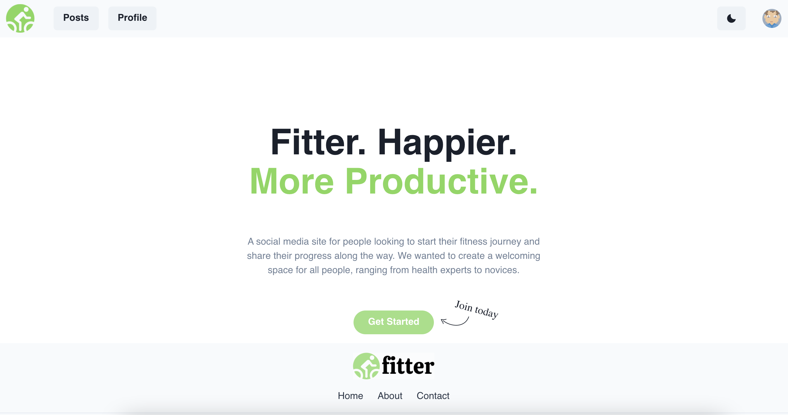
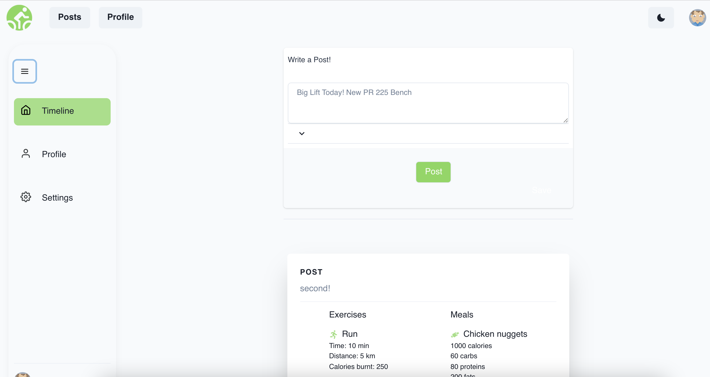
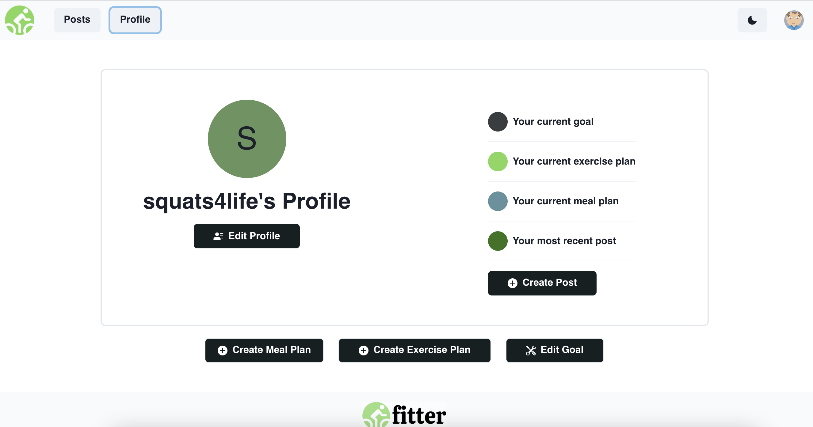
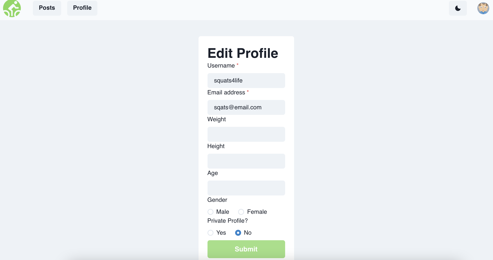
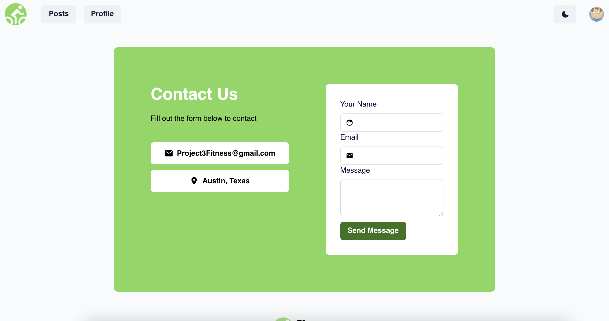
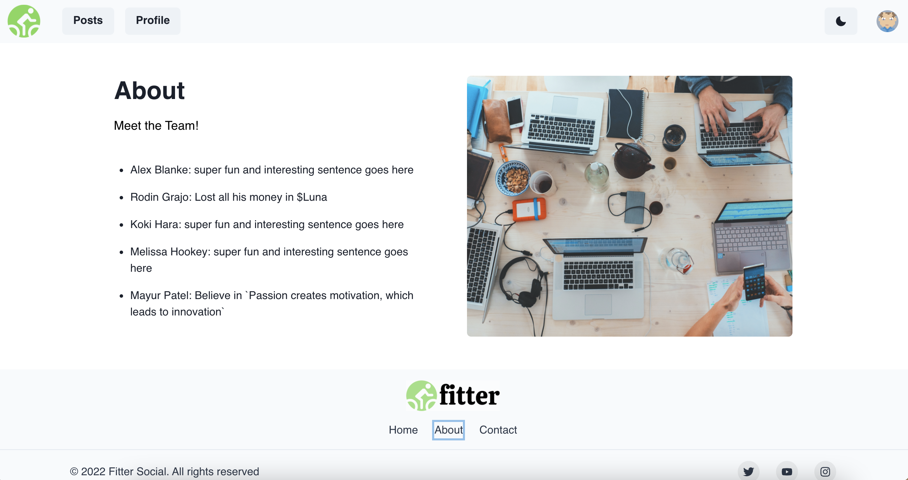

# ✨ Fitter - Social Fitness Network ✨

## Table of Contents

1. [Description](#description)
2. [Deployment](#deployment)
3. [Requirements](#project-requirements)
4. [Technologies](#technologies)
5. [Screenshots](#screenshots)
6. [Contributors](#contributors)

## Description

For people passionate about fitness and health, social networks can be a great way to keep in touch with friends and loved ones. Fitter is is a free fitness social network and web based solution to set your exercise routine, meal plan, and goals. Fitter allows friends to follow each other’s workouts in real time, and even to make encouraging comments.

## Deployment

Deployed Application: https://fitter-bc2022.herokuapp.com/

## Project Requirements

- Use React for the front end.
- Use GraphQL with a Node.js and Express.js server.
- Use MongoDB and the Mongoose ODM for the database.
- Use queries and mutations for retrieving, adding, updating, and deleting data.
- Be deployed using Heroku (with data).
- Have a polished UI.
- Be responsive.
- Be interactive (i.e., accept and respond to user input).
- Include authentication (JWT).
- Protect sensitive API key information on the server.
- Meet good-quality coding standards (file structure, naming conventions, follows best practices for class/id naming conventions, indentation, quality comments, etc.).
- Have a high-quality README (with unique name, description, technologies used, screenshot, and link to deployed application).

## Technologies

- Node.js
- Express.js
- React
- Chakra UI
- MongoDB
- GraphQL
- Nutrition API by Nutritionix
- bcrypt

## Screenshots

## Contributors

- [Alex Blanke](https://github.com/ablanke94)
- [Koki Hara](https://github.com/KokeHaus)
- [Mayur Patel](https://github.com/pmayur0680)
- [Melissa Hookey](https://github.com/melissahookey)
- [Rodin Grajo](https://github.com/yummy314159265)
